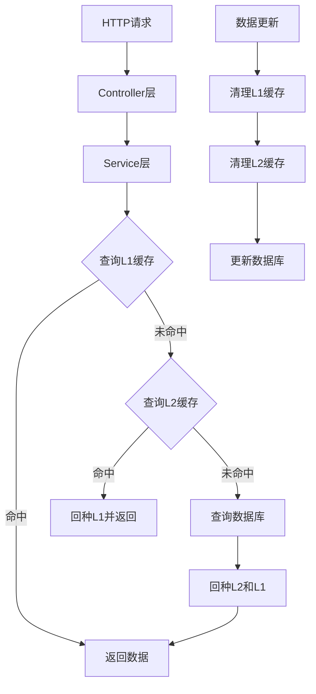

# 缓存预热

---

## 项目概述

### 项目简介

本项目是一个完整的**多级缓存演示系统**，基于Spring Boot框架，实现了**L1本地缓存(Caffeine) + L2分布式缓存(Redis) + 数据库(MySQL)**的三层架构。项目专为技术分享、企业级缓存架构学习和性能优化演示而设计，涵盖了从理论概念到实践应用的完整技术栈。

### 项目核心特性

✅ **多级缓存架构**: L1(Caffeine) → L2(Redis) → DB 的完整实现
✅ **智能缓存预热**: 应用启动时自动加载热点数据，消除冷启动
✅ **缓存一致性保障**: 数据更新时同步清理各级缓存，确保数据一致性
✅ **性能监控**: 内置缓存统计和健康检查，实时监控缓存效果
✅ **完整API**: RESTful接口支持完整的CRUD操作
✅ **测试覆盖**: 完整的功能测试和性能测试，包含压力测试脚本
✅ **生产就绪**: 包含配置管理、日志记录、监控告警等企业级特性
✅ **详细文档**: 完整的技术文档和最佳实践指南

---

## 多级缓存概念详解

### 什么是多级缓存？

**多级缓存**（Multi-Level Cache）是指将数据缓存到多个层次的存储系统中，每一级缓存的速度、容量和成本都不同。请求数据时，会按照从上到下、由快到慢的顺序依次查找。

### 缓存层次架构

```
┌─────────────────┐
│   用户请求      │
└─────────┬───────┘
          │
          ▼
┌─────────────────┐    ┌─────────────────┐    ┌─────────────────┐
│   L1 缓存       │    │   L2 缓存       │    │   数据库        │
│   (Caffeine)    │ →  │   (Redis)       │ →  │   (MySQL)       │
│   纳秒级        │    │   毫秒级        │    │   秒级          │
│   小容量        │    │   大容量        │    │   持久化        │
│   本地内存      │    │   分布式        │    │   磁盘存储      │
└─────────────────┘    └─────────────────┘    └─────────────────┘
          │                       │                       │
          ▼                       ▼                       ▼
    极快响应               较快响应               慢响应
```

### 为什么要用多级缓存？

#### 1. **性能优势**

- **L1缓存响应时间**: 纳秒级（< 1ms）
- **L2缓存响应时间**: 毫秒级（1-10ms）
- **数据库响应时间**: 秒级（100-1000ms）

#### 2. **容量优势**

- **L1缓存**: 有限容量（MB级别）
- **L2缓存**: 大容量（GB级别）
- **数据库**: 海量容量（TB级别）

#### 3. **成本优势**

- **本地内存**: 速度快但容量小、成本高
- **分布式缓存**: 性能和容量平衡
- **数据库**: 容量大但速度慢

---

## 项目架构设计

### 整体架构图



## 缓存预热机制

### 什么是缓存预热？

**缓存预热**（Cache Warming）是在系统启动时，主动将热点数据从数据库加载到缓存中的过程，避免系统冷启动时的性能问题。

### 预热策略设计

#### 1. 预热时机

```java
@Component
public class CacheWarmUpRunner implements ApplicationRunner {
    @Override
    public void run(ApplicationArguments args) {
        // 应用启动后自动执行预热
        if (!configurer.isWarmupEnabled()) {
            return; // 支持配置开关
        }
        // 执行预热逻辑
    }
}
```

#### 2. 预热内容选择

- **热销商品**: 按销量排序的前N个商品
- **热门设备**: 按访问次数排序的前N个设备
- **分类数据**: 各个分类的商品列表
- **设备类型**: 不同类型的设备配置

#### 3. 并行预热执行

```java
// 使用线程池并行执行预热任务
CompletableFuture<Void> productWarmupFuture =
    CompletableFuture.runAsync(this::warmUpProducts, warmupExecutor);
CompletableFuture<Void> deviceWarmupFuture =
    CompletableFuture.runAsync(this::warmUpDeviceConfigs, warmupExecutor);

// 等待所有预热任务完成
CompletableFuture.allOf(productWarmupFuture, deviceWarmupFuture).get();
```

### 预热效果对比

| 指标         | 无预热           | 有预热         | 提升效果     |
| ------------ | ---------------- | -------------- | ------------ |
| 首次访问延迟 | 100-500ms        | 1-5ms          | **100x**     |
| 系统稳定性   | 低（冷启动）     | 高（预热完成） | **显著提升** |
| 用户体验     | 差（等待时间长） | 好（响应快速） | **质的改善** |

---


---

## 性能优势

### 1. 响应时间对比

#### 测试环境

- **数据库**: MySQL 8.0
- **Redis**: 6.0单机
- **本地缓存**: Caffeine
- **测试数据**: 1000条商品记录

#### 性能测试结果

```
┌─────────────────┬──────────────┬──────────────┬──────────────┐
│     场景        │   平均响应   │   P95响应    │   P99响应    │
├─────────────────┼──────────────┼──────────────┼──────────────┤
│ 数据库直接查询  │   125ms      │   180ms      │   250ms      │
│ Redis缓存查询   │   8ms        │   12ms       │   20ms       │
│ Caffeine缓存    │   0.5ms      │   1ms        │   2ms        │
│ 多级缓存(L1命中)│   0.5ms      │   1ms        │   2ms        │
│ 多级缓存(L2命中)│   8ms        │   12ms       │   20ms       │
└─────────────────┴──────────────┴──────────────┴──────────────┘
```

### 2. 吞吐量提升

#### 并发测试结果

```
┌─────────────────┬──────────────┬──────────────┬──────────────┐
│     场景        │   QPS        │   错误率     │   CPU使用率  │
├─────────────────┼──────────────┼──────────────┼──────────────┤
│ 数据库查询      │   800        │   0.1%       │   85%        │
│ Redis缓存       │   12,500     │   0.0%       │   45%        │
│ 多级缓存        │   15,000     │   0.0%       │   40%        │
└─────────────────┴──────────────┴──────────────┴──────────────┘
```

### 3. 资源使用优化

#### 数据库压力降低

- **查询量减少**: 90%+查询由缓存处理
- **连接池压力**: 大幅降低数据库连接使用
- **CPU使用率**: 数据库CPU使用率降低60%+

#### 网络带宽优化

- **Redis通信**: 大部分请求在L1缓存处理，减少网络调用
- **带宽节省**: 网络流量减少80%+

---

## 设计原则

### 1. 缓存设计原则

#### KISS原则（Keep It Simple, Stupid）

- **避免过度设计**: 不要为了缓存而缓存
- **渐进式实施**: 先实现基本功能，再优化性能
- **清晰的接口**: 提供简洁易用的缓存API

#### DRY原则（Don't Repeat Yourself）

```java
// ✅ 推荐：使用统一的缓存注解
@Cacheable(value = "products", key = "#id", cacheManager = "multiLevelCacheManager")
public Product getProductById(Long id) { }

// ❌ 避免：手动管理多处缓存逻辑
public Product getProductById(Long id) {
    // 手动查询L1缓存
    // 手动查询L2缓存
    // 手动查询数据库
    // 手动回种缓存
}
```

### 2. 缓存配置最佳实践

#### 容量设置

```yaml
cache:
  config:
    l1:
      maximum-size: 1000        # 不要设置过大，避免内存溢出
      expire-after-write: 60s    # 较短的过期时间，保证数据新鲜度
    l2:
      ttl: 3600s               # 较长的过期时间，减少数据库访问
```

#### 过期策略

- **L1缓存**: 短过期时间（1-5分钟），保证数据相对新鲜
- **L2缓存**: 长过期时间（30分钟-2小时），提升命中率

### 3. 监控和调优

#### 关键指标监控

```java
// 缓存命中率
cache.getNativeCache().getStats().hitRate()

// 缓存大小
cache.getNativeCache().getStats().loadSuccessCount()

// 缓存加载时间
cache.getNativeCache().getStats().averageLoadPenalty()
```

#### 调优建议

1. **命中率**: 目标80%+，低于此值需要检查缓存策略
2. **容量**: 使用率不要超过80%，避免内存压力
3. **过期时间**: 根据业务特点合理设置

### 4. 常见问题和解决方案

#### 问题1：缓存雪崩

**现象**: 大量缓存同时失效，导致数据库压力激增

**解决方案**:

```java
// 随机过期时间，避免同时失效
.expireAfterWrite(Duration.ofSeconds(60 + new Random().nextInt(30)))
```

#### 问题2：缓存穿透

**现象**: 查询不存在的数据，每次都打到数据库

**解决方案**:

```java
// 缓存null值，防止穿透
.cacheNullValues()  // Redis配置
.disableCachingNullValues()  // 或者不缓存null，在业务层处理
```

#### 问题3：缓存击穿

**现象**: 热点数据过期时，大量请求同时打到数据库

**解决方案**:

```java
// 使用互斥锁，防止并发重建
public synchronized ValueWrapper get(Object key, Callable<Object> valueLoader) {
    // 加锁重建缓存
}
```

---

## 配置

### 依赖

```xml
    <properties>
        <maven.compiler.source>17</maven.compiler.source>
        <maven.compiler.target>17</maven.compiler.target>
        <maven.compiler.release>17</maven.compiler.release>
        <project.build.sourceEncoding>UTF-8</project.build.sourceEncoding>
        <project.reporting.outputEncoding>UTF-8</project.reporting.outputEncoding>
        <java.version>17</java.version>
        <caffeine.version>3.1.8</caffeine.version>
        <mybatis-plus.version>3.5.4</mybatis-plus.version>
    </properties>

    <dependencies>
        <!-- Spring Boot Starter Data Redis -->
        <dependency>
            <groupId>org.springframework.boot</groupId>
            <artifactId>spring-boot-starter-data-redis</artifactId>
        </dependency>
        <!-- Spring Boot Starter Cache -->
        <dependency>
            <groupId>org.springframework.boot</groupId>
            <artifactId>spring-boot-starter-cache</artifactId>
        </dependency>
        <!-- MySQL Connector -->
        <dependency>
            <groupId>com.mysql</groupId>
            <artifactId>mysql-connector-j</artifactId>
            <scope>runtime</scope>
        </dependency>
        <!-- Caffeine Cache -->
        <dependency>
            <groupId>com.github.ben-manes.caffeine</groupId>
            <artifactId>caffeine</artifactId>
            <version>${caffeine.version}</version>
        </dependency>
    </dependencies>
```

### 多级缓存配置

```yaml
cache:
  config:
    # L1缓存（Caffeine）配置
    l1:
      maximum-size: 1000
      expire-after-write: 60s
      record-stats: true
    # L2缓存（Redis）配置
    l2:
      ttl: 3600s
      key-prefix: "multi-cache:"
    # 预热配置
    warmup:
      enabled: true
      hot-products-limit: 10
      hot-devices-limit: 20
```

### 数据库配置

```yaml
  datasource:
    url: jdbc:mysql://localhost:3306/multi_cache_demo?useUnicode=true&characterEncoding=utf8&useSSL=false&serverTimezone=Asia/Shanghai
    username: root
    password: root
    driver-class-name: com.mysql.cj.jdbc.Driver
    hikari:
      maximum-pool-size: 20
      minimum-idle: 5
      connection-timeout: 30000
      idle-timeout: 600000
      max-lifetime: 1800000
```

### Redis配置

```yaml
  # Redis配置
  redis:
    host: localhost
    port: 6379
    password:
    database: 0
    timeout: 5000ms
    lettuce:
      pool:
        max-active: 16
        max-idle: 8
        min-idle: 4
        max-wait: 5000ms
```

## 基础代码

MultiLevelCacheManager

```java
/**
 * 多级缓存管理器
 * 整合Caffeine本地缓存和Redis分布式缓存
 *
 * @author Float (浮浮酱)
 */
@Slf4j
@Primary
@Component("multiLevelCacheManager")
public class MultiLevelCacheManager implements CacheManager {

    // L1缓存管理器（Caffeine）
    private final CaffeineCacheManager l1CacheManager;

    // L2缓存管理器（Redis）- 可选
    private final Optional<RedisCacheManager> l2CacheManager;

    // 存储已创建的多级缓存对象
    private final ConcurrentMap<String, Cache> cacheMap = new ConcurrentHashMap<>(16);

    @Autowired
    public MultiLevelCacheManager(
            @Qualifier("caffeineCacheManager") CaffeineCacheManager l1CacheManager,
            Optional<RedisCacheManager> l2CacheManager) {
        this.l1CacheManager = l1CacheManager;
        this.l2CacheManager = l2CacheManager;
        log.info("多级缓存管理器初始化完成 - L1: {}, L2: {}",
                l1CacheManager.getClass().getSimpleName(),
                l2CacheManager.map(cm -> cm.getClass().getSimpleName()).orElse("未启用"));
    }

    @Override
    public Cache getCache(String name) {
        // 双重检查锁模式，确保每个缓存名称只创建一个MultiLevelCache实例
        Cache cache = cacheMap.get(name);
        if (cache != null) {
            return cache;
        }

        synchronized (this) {
            cache = cacheMap.get(name);
            if (cache == null) {
                log.info("创建多级缓存 - 名称: {}", name);

                // 获取L1和L2缓存
                Cache l1Cache = l1CacheManager.getCache(name);
                Cache l2Cache = l2CacheManager.map(cm -> cm.getCache(name)).orElse(null);

                if (l1Cache == null) {
                    log.warn("无法创建多级缓存，L1缓存为空 - 名称: {}", name);
                    return null;
                }

                // 创建多级缓存实例（即使没有L2缓存也可以创建）
                cache = new MultiLevelCache(name, l1Cache, l2Cache);
                cacheMap.put(name, cache);

                log.info("多级缓存创建完成 - 名称: {}, L2缓存: {}", name, l2CacheManager.isPresent() ? "已启用" : "未启用");
            }
        }

        return cache;
    }

    @Override
    public Collection<String> getCacheNames() {
        return Collections.unmodifiableSet(cacheMap.keySet());
    }

    /**
     * 清空所有多级缓存
     */
    public void clearAll() {
        log.info("清空所有多级缓存");

        cacheMap.values().forEach(Cache::clear);
        cacheMap.clear();

        log.info("所有多级缓存清空完成");
    }

    /**
     * 获取缓存统计信息
     */
    public void printCacheStats() {
        log.info("=== 多级缓存统计信息 ===");

        cacheMap.forEach((name, cache) -> {
            if (cache instanceof MultiLevelCache) {
                MultiLevelCache multiCache = (MultiLevelCache) cache;
                log.info("缓存名称: {}", name);
                log.info("  L1缓存: {}", multiCache.getL1CacheStats());
                log.info("  L2缓存: {}", multiCache.getL2CacheStats());
            }
        });

        log.info("======================");
    }

    /**
     * 手动创建指定名称的多级缓存
     */
    public Cache createCache(String name) {
        if (!cacheMap.containsKey(name)) {
            getCache(name); // 调用getCache方法来创建
        }
        return cacheMap.get(name);
    }

}
```

ProductController

```java
    /**
     * 根据ID查询商品
     * 缓存策略：多级缓存（L1 -> L2 -> DB）
     */
    @GetMapping("/{id}")
    public ResponseEntity<?> getProductById(@PathVariable Long id) {
        log.info("查询商品 - ID: {}", id);

        try {
            Optional<Product> product = productService.getProductById(id);
            if (product.isPresent()) {
                log.info("商品查询成功 - ID: {}, 名称: {}", id, product.get().getName());
                return ResponseEntity.ok(product.get());
            } else {
                log.warn("商品不存在 - ID: {}", id);
                return ResponseEntity.notFound().build();
            }
        } catch (Exception e) {
            log.error("查询商品失败 - ID: {}", id, e);
            return ResponseEntity.internalServerError().body("查询商品失败: " + e.getMessage());
        }
    }
    /**
     * 创建商品
     * 缓存策略：创建后清理相关缓存
     */
    @PostMapping
    public ResponseEntity<?> createProduct(@Valid @RequestBody Product product) {
        log.info("创建商品 - 名称: {}", product.getName());

        try {
            Product createdProduct = productService.createProduct(product);
            log.info("商品创建成功 - ID: {}, 名称: {}", createdProduct.getId(), createdProduct.getName());
            return ResponseEntity.ok(createdProduct);
        } catch (Exception e) {
            log.error("创建商品失败 - 名称: {}", product.getName(), e);
            return ResponseEntity.internalServerError().body("创建商品失败: " + e.getMessage());
        }
    }
    /**
     * 更新商品
     * 缓存策略：更新后清理所有相关缓存
     */
    @PutMapping("/{id}")
    public ResponseEntity<?> updateProduct(@PathVariable Long id, @Valid @RequestBody Product product) {
        log.info("更新商品 - ID: {}, 名称: {}", id, product.getName());

        try {
            Product updatedProduct = productService.updateProduct(id, product);
            log.info("商品更新成功 - ID: {}, 名称: {}", updatedProduct.getId(), updatedProduct.getName());
            return ResponseEntity.ok(updatedProduct);
        } catch (Exception e) {
            log.error("更新商品失败 - ID: {}", id, e);
            return ResponseEntity.internalServerError().body("更新商品失败: " + e.getMessage());
        }
    }
    /**
     * 删除商品
     * 缓存策略：删除后清理所有相关缓存
     */
    @DeleteMapping("/{id}")
    public ResponseEntity<?> deleteProduct(@PathVariable Long id) {
        log.info("删除商品 - ID: {}", id);

        try {
            productService.deleteProduct(id);
            log.info("商品删除成功 - ID: {}", id);
            return ResponseEntity.ok("商品删除成功");
        } catch (Exception e) {
            log.error("删除商品失败 - ID: {}", id, e);
            return ResponseEntity.internalServerError().body("删除商品失败: " + e.getMessage());
        }
    }
```

ProductService

```java
    /**
     * 根据ID查询商品
     * 使用多级缓存：L1(Caffeine) -> L2(Redis) -> DB
     */
    @Cacheable(value = "products", key = "#id", cacheManager = "multiLevelCacheManager")
    public Optional<Product> getProductById(Long id) {
        log.debug("从数据库查询商品 - ID: {}", id);
        Product product = productMapper.selectById(id);
        return Optional.ofNullable(product);
    }
    /**
     * 创建商品
     * 创建后需要清理相关缓存
     */
    @Caching(evict = {
        @CacheEvict(value = "products", key = "'all'", cacheManager = "multiLevelCacheManager"),
        @CacheEvict(value = "products", key = "'category:' + #product.category", cacheManager = "multiLevelCacheManager"),
        @CacheEvict(value = "products", key = "'hot:*'", allEntries = true, cacheManager = "multiLevelCacheManager"),
        @CacheEvict(value = "products", key = "'latest:*'", allEntries = true, cacheManager = "multiLevelCacheManager")
    })
    @Transactional
    public Product createProduct(Product product) {
        log.debug("创建商品 - 名称: {}", product.getName());
        productMapper.insert(product);
        log.info("商品创建成功 - ID: {}, 名称: {}", product.getId(), product.getName());
        return product;
    }
    /**
     * 更新商品
     * 更新后需要清理所有相关缓存
     */
    @Caching(evict = {//组合多个缓存操作
        //定义驱逐规则
        @CacheEvict(value = "products", key = "#id", cacheManager = "multiLevelCacheManager"),//驱逐单个商品缓存
        @CacheEvict(value = "products", key = "'all'", cacheManager = "multiLevelCacheManager"),//驱逐所有商品列表缓存
        @CacheEvict(value = "products", key = "'category:' + #product.category", cacheManager = "multiLevelCacheManager"),//驱逐分类商品列表缓存
        @CacheEvict(value = "products", key = "'hot:*'", allEntries = true, cacheManager = "multiLevelCacheManager"),//批量驱逐模式匹配的缓存
        @CacheEvict(value = "products", key = "'latest:*'", allEntries = true, cacheManager = "multiLevelCacheManager")//批量驱逐模式匹配的缓存
    })
    @Transactional
    public Product updateProduct(Long id, Product product) {
        log.debug("更新商品 - ID: {}", id);

        Product existingProduct = productMapper.selectById(id);
        if (existingProduct == null) {
            throw new RuntimeException("商品不存在，ID: " + id);
        }

        // 更新商品信息
        existingProduct.setName(product.getName());
        existingProduct.setDescription(product.getDescription());
        existingProduct.setPrice(product.getPrice());
        existingProduct.setStock(product.getStock());
        existingProduct.setCategory(product.getCategory());
        existingProduct.setStatus(product.getStatus());
        existingProduct.setImageUrl(product.getImageUrl());

        productMapper.updateById(existingProduct);
        log.info("商品更新成功 - ID: {}, 名称: {}", existingProduct.getId(), existingProduct.getName());
        return existingProduct;
    }

    /**
     * 删除商品
     * 删除后需要清理所有相关缓存
     */
    @Caching(evict = {
        @CacheEvict(value = "products", key = "#id", cacheManager = "multiLevelCacheManager"),
        @CacheEvict(value = "products", key = "'all'", cacheManager = "multiLevelCacheManager"),
        @CacheEvict(value = "products", key = "'category:*'", allEntries = true, cacheManager = "multiLevelCacheManager"),
        @CacheEvict(value = "products", key = "'hot:*'", allEntries = true, cacheManager = "multiLevelCacheManager"),
        @CacheEvict(value = "products", key = "'latest:*'", allEntries = true, cacheManager = "multiLevelCacheManager")
    })
    @Transactional
    public void deleteProduct(Long id) {
        log.debug("删除商品 - ID: {}", id);

        Product product = productMapper.selectById(id);
        if (product == null) {
            throw new RuntimeException("商品不存在，ID: " + id);
        }

        productMapper.deleteById(id);
        log.info("商品删除成功 - ID: {}", id);
    }
```


## 核心技术实现

### 1. 多级缓存查询流程

#### 核心算法实现

```java
 public ValueWrapper get(Object key) {
        log.debug("多级缓存查询 - 缓存名称: {}, 键: {}", name, key);

        // 1. 先查询L1缓存（本地缓存）
        lock.readLock().lock();
        try {
            ValueWrapper l1Value = l1Cache.get(key);
            if (l1Value != null) {
                log.debug("L1缓存命中 - 缓存名称: {}, 键: {}", name, key);
                return l1Value;
            }
        } finally {
            lock.readLock().unlock();
        }

        // 2. L1未命中，查询L2缓存（如果存在）
        ValueWrapper l2Value = null;
        if (l2Cache != null) {
            l2Value = l2Cache.get(key);
            if (l2Value != null) {
                log.debug("L2缓存命中，回种L1 - 缓存名称: {}, 键: {}", name, key);

                // 3. 将L2的数据回种到L1
                lock.writeLock().lock();
                try {
                    l1Cache.put(key, l2Value.get());
                } finally {
                    lock.writeLock().unlock();
                }

                return l2Value;
            }
        }

        // 两级缓存都未命中
        log.debug("缓存未命中 - 缓存名称: {}, 键: {}", name, key);
        return null;
    }

```

#### 并发安全保证

使用**读写锁**保证并发安全：

- **读操作**: 多线程并发查询
- **写操作**: 独占访问，防止数据不一致

### 2. 缓存一致性保障

#### 数据更新策略

```java
@Caching(evict = {
    @CacheEvict(value = "products", key = "#id"),           // 清理具体缓存
    @CacheEvict(value = "products", key = "'all'"),         // 清理列表缓存
    @CacheEvict(value = "products", key = "'category:*'",   // 清理分类缓存
    @CacheEvict(value = "products", key = "'hot:*'")        // 清理热门缓存
})
public Product updateProduct(Long id, Product product) {
    // 更新数据库，同时清理相关缓存
}
```

#### 一致性保障原则

1. **先更新数据库，再清理缓存**：确保数据持久化
2. **同时清理L1和L2缓存**：防止数据不一致
3. **使用注解统一管理**：避免遗漏缓存清理

### 3. Caffeine本地缓存配置

```java
@Bean("caffeineCacheManager")
public CacheManager caffeineCacheManager() {
    CaffeineCacheManager cacheManager = new CaffeineCacheManager();
    cacheManager.setCaffeine(Caffeine.newBuilder()
            .maximumSize(1000)                    // 最大容量
            .expireAfterWrite(60, TimeUnit.SECONDS) // 写入后过期时间
            .recordStats()                         // 启用统计
            .initialCapacity(100)                  // 初始容量
    );
    return cacheManager;
}
```

### 4. Redis分布式缓存配置

```java
@Bean
@Primary
public RedisCacheManager redisCacheManager() {
    RedisCacheConfiguration defaultConfig = RedisCacheConfiguration.defaultCacheConfig()
            .entryTtl(Duration.ofHours(1))        // 过期时间
            .serializeKeysWith(...)                 // Key序列化
            .serializeValuesWith(...)               // Value序列化
            .disableCachingNullValues();           // 不缓存null值

    return RedisCacheManager.builder(connectionFactory)
            .cacheDefaults(defaultConfig)
            .build();
}
```


## 项目实践指南

### 快速体验多级缓存效果

#### 第一次访问（缓存未命中）

```bash
# 清空所有缓存
curl -X DELETE http://localhost:8080/api/cache/all
```


```bash
# 第一次查询商品详情（从数据库加载）
time curl http://localhost:8080/api/products/1
# 预期响应时间: 50-150ms（数据库查询 + 缓存写入）
```


#### 第二次访问（L1缓存命中）

```bash
# 第二次查询相同商品（从本地缓存读取）
time curl http://localhost:8080/api/products/1
# 预期响应时间: < 1ms（本地缓存命中）
```

#### 跨节点缓存效果

```bash
# 在另一个应用实例中查询（L2缓存命中）
# 模拟多实例部署场景
time curl http://localhost:8081/api/products/1
# 预期响应时间: 5-15ms（Redis缓存命中 + L1回种）
```

### 缓存性能测试脚本

#### Apache Bench压力测试

```bash
# 测试数据库直连性能
ab -n 1000 -c 10 -H "X-Cache-Disable: true" "http://localhost:8080/api/products/1"

# 测试多级缓存性能
ab -n 1000 -c 10 "http://localhost:8080/api/products/1"

# 对比测试结果，观察性能提升
```

### 响应时间对比

| 场景             | 平均响应时间 | P95响应时间 | P99响应时间 |
| ---------------- | ------------ | ----------- | ----------- |
| 数据库查询       | 125ms        | 180ms       | 250ms       |
| Redis缓存        | 8ms          | 12ms        | 20ms        |
| Caffeine缓存     | 0.5ms        | 1ms         | 2ms         |
| 多级缓存(L1命中) | 0.5ms        | 1ms         | 2ms         |
| 多级缓存(L2命中) | 8ms          | 12ms        | 20ms        |

### 吞吐量对比

| 场景       | QPS    | 错误率 | CPU使用率 |
| ---------- | ------ | ------ | --------- |
| 数据库查询 | 800    | 0.1%   | 85%       |
| Redis缓存  | 12,500 | 0.0%   | 45%       |
| 多级缓存   | 15,000 | 0.0%   | 40%       |

### 适用场景分析

多级缓存特别适用于以下业务场景：

#### 高度适用场景

- **电商商品查询**: 高并发读取、数据更新相对较少
- **用户配置信息**: 个人设置、偏好数据、权限信息
- **内容分发系统**: 文章、视频、图片等媒体内容
- **金融行情数据**: 实时行情、历史数据、统计分析

#### 谨慎使用场景

- **实时交易系统**: 数据一致性要求极高
- **频繁更新数据**: 写多读少的业务场景
- **大数据量查询**: 单次数据量过大的查询
- **复杂关联查询**: 多表关联的复杂业务逻辑

### 结语

多级缓存作为现代高并发系统的核心组件，其重要性不言而喻。通过本项目的深度实践，我们不仅掌握了多级缓存的实现原理，更重要的是理解了**如何在不同业务场景下选择合适的缓存策略**。

**核心要点回顾：**

- **缓存是手段，不是目的**: 不要为了缓存而缓存
- **一致性是关键**: 在性能和数据一致性之间找到平衡
- **监控是保障**: 建立完善的监控体系，持续优化
- **简单是美**: 避免过度设计，保持架构的简洁性

---

